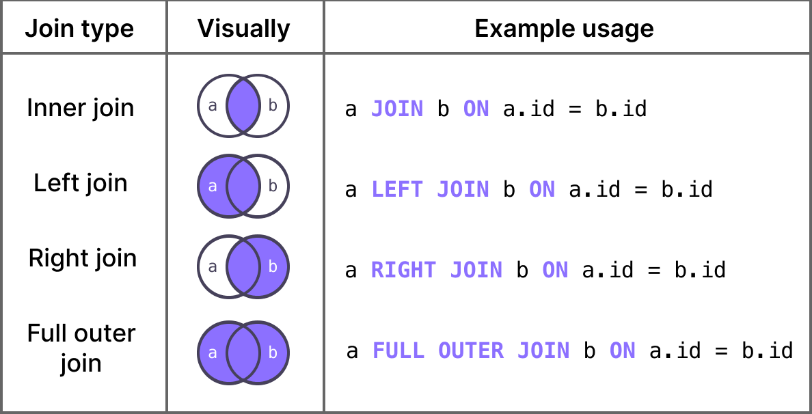

## SQL Joins Explanation and Examples

Joins allow us to combine data from multiple tables based on a related column. Using the correct type of join is crucial to avoid missing data or getting incorrect results.

### 1. INNER JOIN
Returns only matching records from both tables. If a record has no match in the second table, it is excluded from the result.

For example, if you join two tables, and the first table has 100 records while the second has 10, but only 5 of them have matching values in both tables, then the result will contain only 5 records.

If you do not define the method of join (INNER, LEFT, etc.), the default join will be an **INNER JOIN**.

#### Example: List All Orders with Product Details
```sql
SELECT
    o.orderNumber,
    o.orderDate,
    od.productCode,
    od.quantityOrdered,
    od.priceEach
FROM orders o
INNER JOIN orderdetails od ON o.orderNumber = od.orderNumber
ORDER BY o.orderNumber;
```

`ON` is used to specify the column that both tables share. This column is called a **Foreign Key (FK)**. You will also encounter **Primary Keys (PK)**, which ensure that values in a table are unique. The same column can be both a **Primary Key (PK)** and a **Foreign Key (FK)**, or one column can be a PK while another is an FK.

You can include the FK in the `SELECT` statement or omit it. Also, as shown above, we use table aliases (e.g., `customers` as `c` and `orders` as `o`). When selecting columns with the same name from different tables, you must specify the table name (e.g., `c.customerNumber` or `o.customerNumber`) to avoid confusion.

```sql
SELECT *
FROM customers c
INNER JOIN orders o ON c.customerNumber = o.customerNumber
ORDER BY c.customerNumber;
```

If you use `SELECT *`, you will get duplicate `customerNumber` columns since both tables contain this column. To avoid this, it is better to define explicitly which columns to select.

In well-structured databases, the column names for related fields are usually the same to facilitate easy querying.

### 2. LEFT JOIN (LEFT OUTER JOIN)
Returns all records from the left table and matching records from the right table. If there is no match, it still returns the left table’s row, but missing values are filled with NULL.

#### Example: List All Customers and Their Orders (Even If No Orders Exist)
```sql
SELECT
    c.customerNumber,
    c.customerName,
    o.orderNumber,
    o.orderDate
FROM customers c
LEFT JOIN orders o ON c.customerNumber = o.customerNumber
ORDER BY c.customerNumber;
```

### 3. RIGHT JOIN (RIGHT OUTER JOIN)
Returns all records from the right table and matching records from the left table. If no match exists, it still returns the right table’s row with NULL for missing values.

#### Example: List All Orders and Their Customers (Even If Customer Info is Missing)
```sql
SELECT
    o.orderNumber,
    o.orderDate,
    c.customerName,
    c.phone
FROM orders o
RIGHT JOIN customers c ON o.customerNumber = c.customerNumber
ORDER BY o.orderNumber;
```

### 4. FULL JOIN (FULL OUTER JOIN)
Combines the results of both **LEFT JOIN** and **RIGHT JOIN**. Returns all records from both tables, filling missing data with NULL.

For example, if one table has 10 records and the other has 5, the result will have 15 records in total. **However, MySQL does not support FULL JOIN directly**, but you can achieve the same result using **UNION**.

#### Example: Show All Orders and All Customers (Even If They Don’t Have a Match)
```sql
SELECT
    c.customerNumber,
    c.customerName,
    o.orderNumber,
    o.orderDate
FROM customers c
FULL JOIN orders o ON c.customerNumber = o.customerNumber
ORDER BY c.customerNumber;
```

Since MySQL does not support FULL JOIN, we can achieve the same result using **UNION**:

```sql
SELECT
    c.customerNumber,
    c.customerName,
    o.orderNumber
FROM customers c  
LEFT JOIN orders o ON c.customerNumber = o.customerNumber

UNION

SELECT
    c.customerNumber,
    c.customerName,
    o.orderNumber
FROM orders o  
LEFT JOIN customers c ON c.customerNumber = o.customerNumber;
```

### 5. UNION
Combines the results of two separate queries with the same structure. **It removes duplicates unless UNION ALL is used**.

#### Example: Get a List of All Customer and Employee Emails
```sql
SELECT customerNumber
FROM customers c

UNION

SELECT customerNumber
FROM orders o
ORDER BY customerNumber;
```

When using `UNION`, the column names and the number of columns in both queries must be the same. Otherwise, you may get incorrect or mixed results.

To achieve **FULL OUTER JOIN** in MySQL, we can use `UNION` as follows:
```sql
SELECT
    c.customerNumber,
    c.customerName,
    o.orderNumber
FROM customers c  
LEFT JOIN orders o ON c.customerNumber = o.customerNumber

UNION

SELECT
    c.customerNumber,
    c.customerName,
    o.orderNumber
FROM orders o  
LEFT JOIN customers c ON c.customerNumber = o.customerNumber;
```

### Finding Customers Who Ordered a Product but Haven’t Paid Yet
To identify customers who placed an order but haven’t made a payment, we can use:

```sql
SELECT *
FROM orders o
WHERE o.customerNumber NOT IN (
    SELECT p.customerNumber
    FROM payments p
);
```

Alternatively, a more efficient way to solve this problem is:
```sql
SELECT
    o.orderNumber,
    p.customerNumber
FROM payments p
LEFT JOIN orders o ON p.customerNumber = o.customerNumber
WHERE o.orderNumber IS NULL;
```

### Final Thoughts
| Join Type  | What It Does | When to Use | Risk If Used Incorrectly |
|------------|-------------|-------------|-------------------------|
| INNER JOIN | Only matching records | When you need only related data | Can lose unmatched data |
| LEFT JOIN | All left table records + matches from right | When left-side data is important | Missing right-side data |
| RIGHT JOIN | All right table records + matches from left | When right-side data is important | Missing left-side data |
| FULL JOIN | All records from both tables | When you need all data, even unmatched | Large result sets with many NULLs |
| UNION | Merges results from two queries | When combining similar datasets | Can remove needed duplicates |



**Source:** [TryExponent](https://www.tryexponent.com/)

