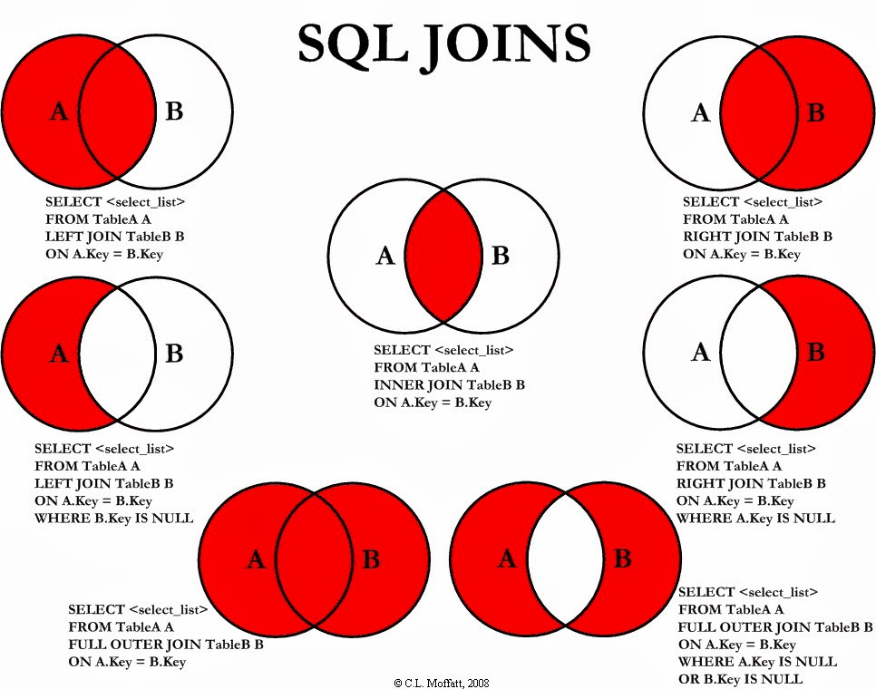

# SQL Joins: Comprehensive Explanation and Examples

Joins allow us to combine data from multiple tables based on a related column. Using the correct type of join is crucial to avoid missing data or getting incorrect results.

## Table of Contents
- [Understanding Keys](#understanding-keys)
- [Types of Joins](#types-of-joins)
  1. [INNER JOIN](#1-inner-join)
  2. [LEFT JOIN (LEFT OUTER JOIN)](#2-left-join-left-outer-join)
  3. [RIGHT JOIN (RIGHT OUTER JOIN)](#3-right-join-right-outer-join)
  4. [FULL JOIN (FULL OUTER JOIN)](#4-full-join-full-outer-join)
  5. [UNION](#5-union)
- [Practical Examples](#practical-examples)
- [Final Thoughts](#final-thoughts)
- [Visual Aids](#visual-aids)
- [Additional Resources](#additional-resources)

## Understanding Keys

- **Primary Key (PK)**: Uniquely identifies each record in a table.
- **Foreign Key (FK)**: References the primary key in another table, establishing a relationship between tables.

### Example:
```sql
-- Customers Table
customerNumber (PK)
customerName

-- Orders Table
orderNumber (PK)
customerNumber (FK) -- References Customers.customerNumber
orderDate
```

## Types of Joins

### 1. INNER JOIN
**Definition**: Retrieves only the records that have matching values in both tables.

**When to Use**: When you need data that exists in both tables.

**Risk**: Unmatched records are excluded, which might lead to data loss if not intended.

**Syntax**:
```sql
SELECT columns
FROM table1
INNER JOIN table2 ON table1.commonColumn = table2.commonColumn;
```

**Example: List All Orders with Product Details**
```sql
SELECT
    o.orderNumber,
    o.orderDate,
    od.productCode,
    od.quantityOrdered,
    od.priceEach
FROM orders o
INNER JOIN orderdetails od ON o.orderNumber = od.orderNumber
ORDER BY o.orderNumber;
```

### 2. LEFT JOIN (LEFT OUTER JOIN)
**Definition**: Returns all records from the left table and the matched records from the right table. If there is no match, the result is NULL on the right side.

**When to Use**: When you need all records from the left table, regardless of matches in the right table.

**Syntax**:
```sql
SELECT columns
FROM table1
LEFT JOIN table2 ON table1.commonColumn = table2.commonColumn;
```

**Example: List All Customers and Their Orders (Even If No Orders Exist)**
```sql
SELECT
    c.customerNumber,
    c.customerName,
    o.orderNumber,
    o.orderDate
FROM customers c
LEFT JOIN orders o ON c.customerNumber = o.customerNumber
ORDER BY c.customerNumber;
```

### 3. RIGHT JOIN (RIGHT OUTER JOIN)
**Definition**: Returns all records from the right table and the matched records from the left table. If there is no match, the result is NULL on the left side.

**Syntax**:
```sql
SELECT columns
FROM table1
RIGHT JOIN table2 ON table1.commonColumn = table2.commonColumn;
```

**Example: List All Orders and Their Customers (Even If Customer Info is Missing)**
```sql
SELECT
    o.orderNumber,
    o.orderDate,
    c.customerName,
    c.phone
FROM orders o
RIGHT JOIN customers c ON o.customerNumber = c.customerNumber
ORDER BY o.orderNumber;
```

### 4. FULL JOIN (FULL OUTER JOIN)
**Definition**: Combines the results of both LEFT JOIN and RIGHT JOIN. Returns all records when there is a match in either left or right table. Unmatched records from both sides result in NULL values.

**Syntax**:
```sql
SELECT columns
FROM table1
FULL JOIN table2 ON table1.commonColumn = table2.commonColumn;
```

**Example: Show All Orders and All Customers (Even If They Don’t Have a Match)**
```sql
-- Attempted FULL JOIN (Not supported in MySQL)
SELECT
    c.customerNumber,
    c.customerName,
    o.orderNumber,
    o.orderDate
FROM customers c
FULL JOIN orders o ON c.customerNumber = o.customerNumber
ORDER BY c.customerNumber;
```

**Equivalent in MySQL Using UNION:**
```sql
SELECT
    c.customerNumber,
    c.customerName,
    o.orderNumber,
    o.orderDate
FROM customers c
LEFT JOIN orders o ON c.customerNumber = o.customerNumber

UNION

SELECT
    c.customerNumber,
    c.customerName,
    o.orderNumber,
    o.orderDate
FROM orders o
LEFT JOIN customers c ON c.customerNumber = o.customerNumber
ORDER BY customerNumber;
```

### 5. UNION
**Definition**: Combines the results of two separate SELECT statements into a single result set. It removes duplicate records unless UNION ALL is used.

**Syntax**:
```sql
SELECT column1, column2, ...
FROM table1

UNION

SELECT column1, column2, ...
FROM table2;
```

**Example: Get a List of All Customer and Order Customer Numbers**
```sql
SELECT customerNumber
FROM customers c

UNION

SELECT customerNumber
FROM orders o
ORDER BY customerNumber;
```

## Practical Examples
### Example 1: Finding Customers Who Ordered a Product but Haven’t Paid Yet
**Method 1: Using NOT IN**
```sql
SELECT *
FROM orders o
WHERE o.customerNumber NOT IN (
    SELECT p.customerNumber
    FROM payments p
);
```

**Method 2: Using LEFT JOIN and Filtering NULL**
```sql
SELECT
    o.orderNumber,
    o.customerNumber
FROM orders o
LEFT JOIN payments p ON o.customerNumber = p.customerNumber
WHERE p.customerNumber IS NULL;
```

## Final Thoughts
| Join Type | What It Does | When to Use | Risk If Used Incorrectly |
|-----------|-------------|------------|-------------------------|
| INNER JOIN | Only matching records | When you need only related data | Can lose unmatched data |
| LEFT JOIN | All left table records + matches from right | When left-side data is important | Missing right-side data (NULL) |
| RIGHT JOIN | All right table records + matches from left | When right-side data is important | Missing left-side data (NULL) |
| FULL JOIN | All records from both tables | When you need all data, even unmatched | Large result sets with many NULLs |
| UNION | Merges results from two queries | When combining similar datasets | Can remove needed duplicates |

## Best Practices
- **Always Specify Join Types**: Improves readability and avoids confusion.
- **Use Table Aliases**: Simplifies queries and enhances clarity.
- **Select Necessary Columns**: Avoid using `SELECT *`.
- **Understand Data Relationships**: Helps in choosing appropriate joins.




