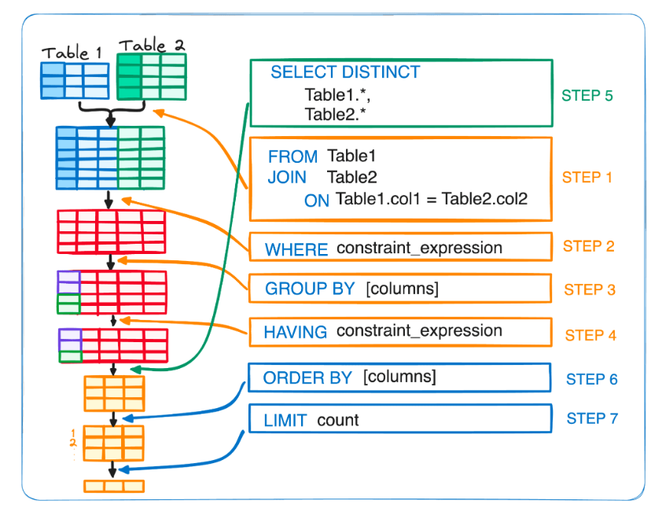

## Aggregate Functions in SQL

### Overview
SQL provides several aggregate functions to perform calculations on a set of values. Below are some commonly used aggregate functions:

- **AVG()** – Calculates the average value of a numeric column.
- **COUNT()** – Counts the number of rows in a column (excluding NULL values).
- **MAX()** – Finds the highest value in a column.
- **MIN()** – Finds the lowest value in a column.
- **SUM()** – Adds up all the values in a numeric column.
- **ROUND()** – Rounds a numeric value to a specified number of decimal places.

### Finding the Maximum and Minimum Payment Amounts

To get the highest and lowest payment amounts:

```sql
SELECT 
    MAX(amount), 
    MIN(amount) 
FROM classicmodels.payments;
```

### Finding the Payment Date of the Maximum Amount

If you try to find the date of the highest payment using:

```sql
SELECT 
    MAX(amount), 
    paymentDate 
FROM classicmodels.payments;
```

You will get an error because `MAX(amount)` returns only one value, but `paymentDate` may have multiple values. To fix this, we need to use **GROUP BY**.

### Using Multiple Aggregate Functions Together

You can combine different aggregate functions in one query:

```sql
SELECT 
    MAX(amount), 
    MIN(amount), 
    AVG(amount) 
FROM classicmodels.payments;
```

### Rounding the Average Value

The `AVG()` function often returns a number with many decimal places. To make it easier to read, we can round the result using `ROUND()`:

```sql
SELECT 
    ROUND(AVG(amount), 2) 
FROM classicmodels.payments;
```

This rounds the average amount to 2 decimal places.

### Calculating the Total Amount of Payments

```sql
SELECT 
    SUM(amount) 
FROM classicmodels.payments;
```

### Using GROUP BY

The `GROUP BY` statement allows us to group rows based on a specific column and perform calculations on each group separately.

For example, if you need to find the total payment amount for each day:

```sql
SELECT 
    paymentDate, 
    SUM(amount) 
FROM classicmodels.payments 
WHERE paymentDate LIKE '2004-%-%' 
GROUP BY paymentDate
ORDER BY paymentDate;
```

### How the Query Works

1. The query selects data from the `payments` table.
2. The `WHERE` clause filters the data before aggregation, ensuring only relevant rows are considered.
3. The `GROUP BY` statement groups the filtered data by `paymentDate`.
4. The `SUM()` function calculates the total payment for each date.
5. The `ORDER BY` statement sorts the results by `paymentDate`.

#### Important SQL Rules:
- Every column in the `SELECT` statement must either be part of an aggregate function or included in the `GROUP BY` clause. This ensures that SQL knows how to handle each selected column.
- The `WHERE` clause cannot refer to the result of an aggregation because filtering occurs before aggregation. Instead, use the `HAVING` clause if you need to filter aggregated results.

### Using Aggregation Functions with ORDER BY

Aggregation functions can also be used with `ORDER BY` to sort results based on calculated values:

```sql
SELECT 
    orderNumber, 
    SUM(quantityOrdered * priceEach) 
FROM orderdetails 
GROUP BY orderNumber 
ORDER BY SUM(quantityOrdered * priceEach) DESC;
```

To make the query more readable, we can use an alias with the `AS` keyword:

```sql
SELECT 
    orderNumber, 
    SUM(quantityOrdered * priceEach) AS total_order_value 
FROM orderdetails 
GROUP BY orderNumber 
ORDER BY total_order_value DESC;
```

This makes it easier to refer to the calculated value in the `ORDER BY` clause. But we can not use the as in where or  statement 

### Ordering by Multiple Columns

We can also order by more than one column. In this case, the order of the columns matters:

```sql
SELECT 
    orderNumber,
    productCode,
    SUM(quantityOrdered) AS total_quantity,
    SUM(quantityOrdered * priceEach) AS total_sales
FROM orderdetails
GROUP BY orderNumber, productCode
ORDER BY total_sales ASC, total_quantity DESC;
```

### Extracting Date Information for Aggregation

If a date column includes hours, minutes, and seconds, you can use the `DATE()` function to extract only the year, month, and day. This can be useful when grouping by date:

```sql
SELECT 
    DATE(paymentDate),
    SUM(amount)
FROM payments p 
GROUP BY DATE(paymentDate);
```

### Using HAVING for Filtering Aggregated Results

Previously, we learned that the `WHERE` clause filters raw data before aggregation. However, `HAVING` is used to filter aggregated results because filtering on aggregation functions like `SUM()` cannot be done in `WHERE`.

```sql
SELECT 
    DATE(paymentDate),
    SUM(amount) AS sum_amount
FROM payments p 
WHERE paymentDate BETWEEN '2003-01-01' AND '2004-01-01'
GROUP BY DATE(paymentDate)
HAVING sum_amount > 5000;
```

### Execution Order of SQL Statements

SQL queries do not execute in the order they are written. Instead, they follow a logical processing order:

```sql
SELECT 
    DATE(paymentDate),
    SUM(amount) AS sum_amount
FROM payments p 
WHERE paymentDate BETWEEN '2003-01-01' AND '2004-01-01'
GROUP BY DATE(paymentDate)
HAVING sum_amount > 5000
ORDER BY sum_amount DESC
LIMIT 10;
```

#### Execution Order:
1. **FROM (`payments` table)** – The database identifies the source table.
2. **WHERE (`paymentDate` filter)** – Filters rows before aggregation to improve performance.
3. **GROUP BY (`DATE(paymentDate)`)** – Groups the remaining rows by date.
4. **SELECT (`SUM(amount) AS sum_amount`)** – Determines which columns to return and performs aggregation.
5. **HAVING (`sum_amount > 5000`)** – Filters aggregated results based on conditions.
6. **ORDER BY (`sum_amount DESC`)** – Sorts the results based on total amount in descending order.
7. **LIMIT (`10`)** – Restricts the number of returned rows to the top 10.

#### Why This Order?
- **FROM first**: SQL needs to determine where to retrieve data.
- **WHERE before GROUP BY**: Filtering before aggregation reduces data size.
- **GROUP BY before HAVING**: Aggregation must happen before filtering on aggregates.
- **SELECT after GROUP BY**: Aggregate calculations depend on grouping.
- **HAVING after SELECT**: Filters results based on aggregated values.
- **ORDER BY after HAVING**: Sorting is applied after filtering.
- **LIMIT last**: Restricts the number of rows after sorting.


source:https://www.kdnuggets.com/

