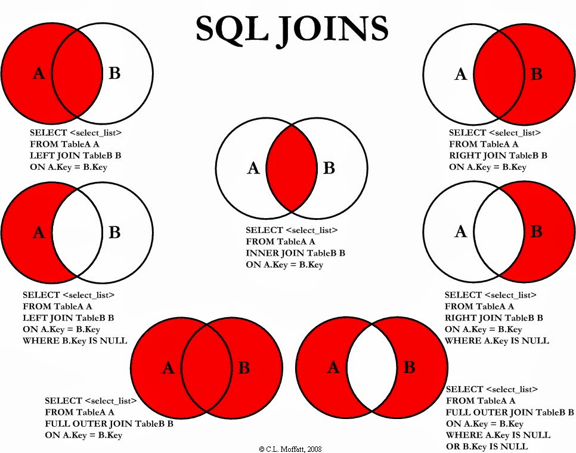

# SQL Joins: Comprehensive Explanation and Examples

Joins allow us to combine data from multiple tables based on a related column. Using the correct type of join is crucial to avoid missing data or getting incorrect results.

## Table of Contents
- [Understanding Keys](#understanding-keys)
- [Types of Joins](#types-of-joins)
  1. [INNER JOIN](#1-inner-join)
  2. [LEFT JOIN (LEFT OUTER JOIN)](#2-left-join-left-outer-join)
  3. [RIGHT JOIN (RIGHT OUTER JOIN)](#3-right-join-right-outer-join)
  4. [FULL JOIN (FULL OUTER JOIN)](#4-full-join-full-outer-join)
  5. [UNION](#5-union)
- [Practical Examples](#practical-examples)
- [Final Thoughts](#final-thoughts)
- [Best Practices](#best-practices)

---

## Understanding Keys

- **Primary Key (PK)**: Uniquely identifies each record in a table.
- **Foreign Key (FK)**: References the primary key in another table, establishing a relationship between tables.

### Example:
```sql
-- Customer Table (dvdrental.customer)
customer_id (PK)
first_name, last_name, email, ...

-- Rental Table (dvdrental.rental)
rental_id (PK)
customer_id (FK) -- References dvdrental.customer.customer_id
rental_date, return_date, ...
```

---

## Types of Joins

### 1. INNER JOIN
**Definition**: Retrieves only the records that have matching values in both tables.

**When to Use**: When you need data that exists in both tables.

**Risk**: Unmatched records are excluded, which might lead to data loss if not intended.

**Syntax**:
```sql
SELECT columns
FROM table1
INNER JOIN table2 ON table1.commonColumn = table2.commonColumn;
```

**Example: List All Rentals with Customer Details**
```sql
SELECT
    r.rental_id,
    r.rental_date,
    c.customer_id,
    c.first_name,
    c.last_name
FROM dvdrental.rental r
INNER JOIN dvdrental.customer c ON r.customer_id = c.customer_id
ORDER BY r.rental_id;
```

---

### 2. LEFT JOIN (LEFT OUTER JOIN)
**Definition**: Returns all records from the left table and the matched records from the right table. If there is no match, the result is NULL on the right side.

**When to Use**: When you need all records from the left table, regardless of matches in the right table.

**Syntax**:
```sql
SELECT columns
FROM table1
LEFT JOIN table2 ON table1.commonColumn = table2.commonColumn;
```

**Example: List All Customers and Their Rentals (Even If No Rentals Exist)**
```sql
SELECT
    c.customer_id,
    c.first_name,
    c.last_name,
    r.rental_id,
    r.rental_date
FROM dvdrental.customer c
LEFT JOIN dvdrental.rental r ON c.customer_id = r.customer_id
ORDER BY c.customer_id;
```

---

### 3. RIGHT JOIN (RIGHT OUTER JOIN)
**Definition**: Returns all records from the right table and the matched records from the left table. If there is no match, the result is NULL on the left side.

**Syntax**:
```sql
SELECT columns
FROM table1
RIGHT JOIN table2 ON table1.commonColumn = table2.commonColumn;
```

**Example: List All Rentals and Their Customers (Even If Customer Info is Missing)**
```sql
SELECT
    r.rental_id,
    r.rental_date,
    c.first_name,
    c.last_name
FROM dvdrental.rental r
RIGHT JOIN dvdrental.customer c ON r.customer_id = c.customer_id
ORDER BY r.rental_id;
```

---

### 4. FULL JOIN (FULL OUTER JOIN)
**Definition**: Combines the results of both LEFT JOIN and RIGHT JOIN. Returns all records when there is a match in either the left or right table. Unmatched records from both sides result in NULL values.

**Syntax**:
```sql
SELECT columns
FROM table1
FULL JOIN table2 ON table1.commonColumn = table2.commonColumn;
```

**Example: Show All Rentals and All Customers (Even If They Don’t Have a Match)**
```sql
SELECT
    c.customer_id,
    c.first_name,
    c.last_name,
    r.rental_id,
    r.rental_date
FROM dvdrental.customer c
FULL JOIN dvdrental.rental r ON c.customer_id = r.customer_id
ORDER BY c.customer_id;
```

---

### 5. UNION
**Definition**: Combines the results of two separate SELECT statements into a single result set. It removes duplicate records unless UNION ALL is used.

**Syntax**:
```sql
SELECT column1, column2, ...
FROM table1

UNION

SELECT column1, column2, ...
FROM table2;
```

**Example: Get a List of All Customer IDs from Both Customers and Rentals**
```sql
SELECT customer_id
FROM dvdrental.customer

UNION

SELECT customer_id
FROM dvdrental.rental
ORDER BY customer_id;
```

---

## Practical Examples

### Example 1: Finding Customers Who Have Rentals but Haven’t Made a Payment Yet

**Method 1: Using NOT IN**
```sql
SELECT *
FROM dvdrental.rental r
WHERE r.customer_id NOT IN (
    SELECT p.customer_id
    FROM dvdrental.payment p
);
```

**Method 2: Using LEFT JOIN and Filtering NULL**
```sql
SELECT
    r.rental_id,
    r.customer_id
FROM dvdrental.rental r
LEFT JOIN dvdrental.payment p ON r.customer_id = p.customer_id
WHERE p.customer_id IS NULL;
```


---

## Final Thoughts

| Join Type     | What It Does                     | When to Use                              | Risk If Used Incorrectly              |
|---------------|----------------------------------|------------------------------------------|---------------------------------------|
| INNER JOIN    | Only matching records            | When you need only related data          | Can lose unmatched data               |
| LEFT JOIN     | All left table records + matches from right | When left-side data is important   | Missing right-side data (NULL)        |
| RIGHT JOIN    | All right table records + matches from left | When right-side data is important  | Missing left-side data (NULL)         |
| FULL JOIN     | All records from both tables     | When you need all data, even unmatched   | Large result sets with many NULLs     |
| UNION         | Merges results from two queries  | When combining similar datasets          | Can remove needed duplicates          |

---

## Best Practices
- **Always Specify Join Types**: Improves readability and avoids confusion.
- **Use Table Aliases**: Simplifies queries and enhances clarity.
- **Select Only Necessary Columns**: Avoid using `SELECT *` to reduce overhead.
- **Understand Data Relationships**: Helps in choosing the appropriate join type.



